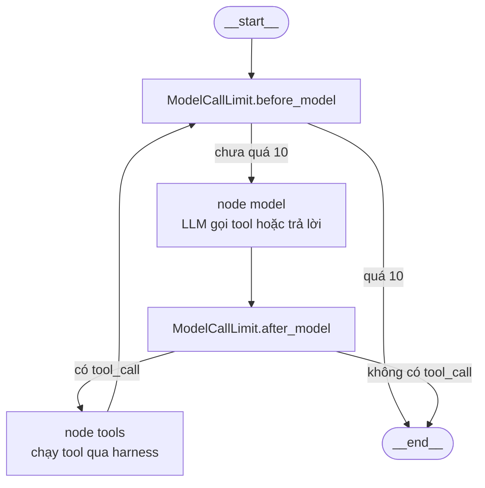
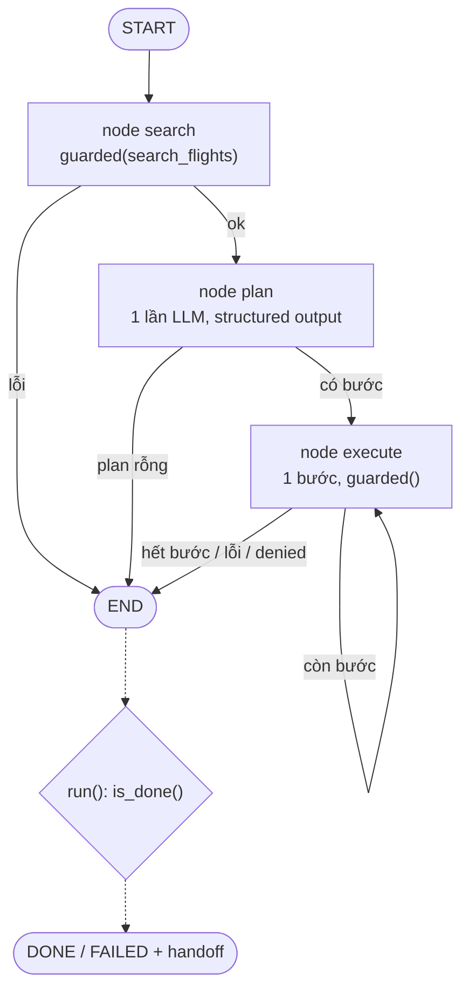
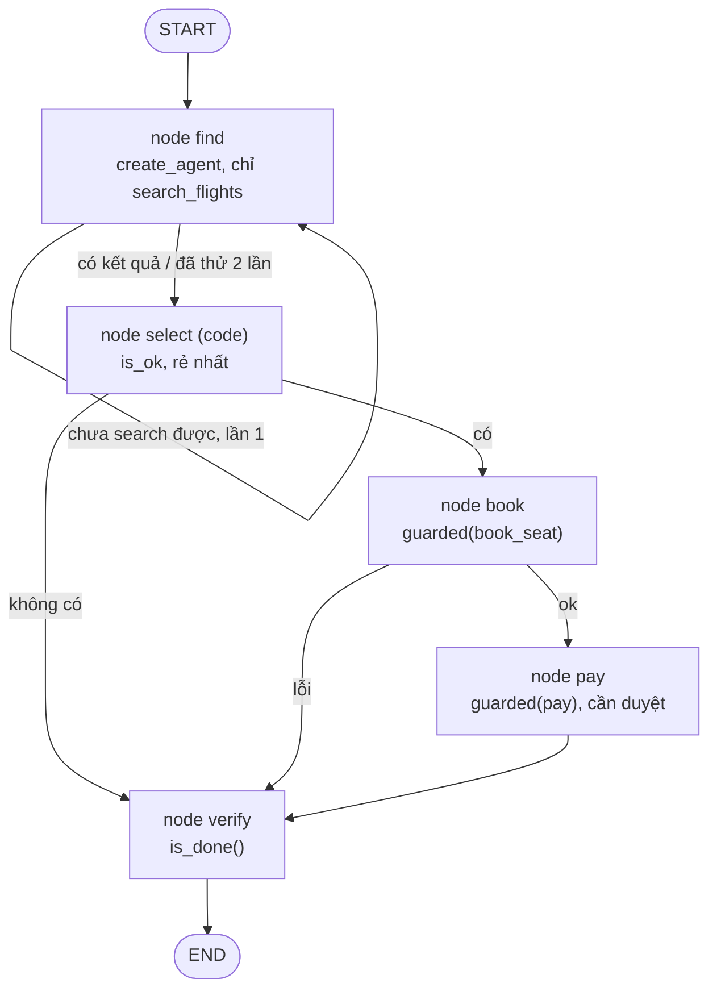
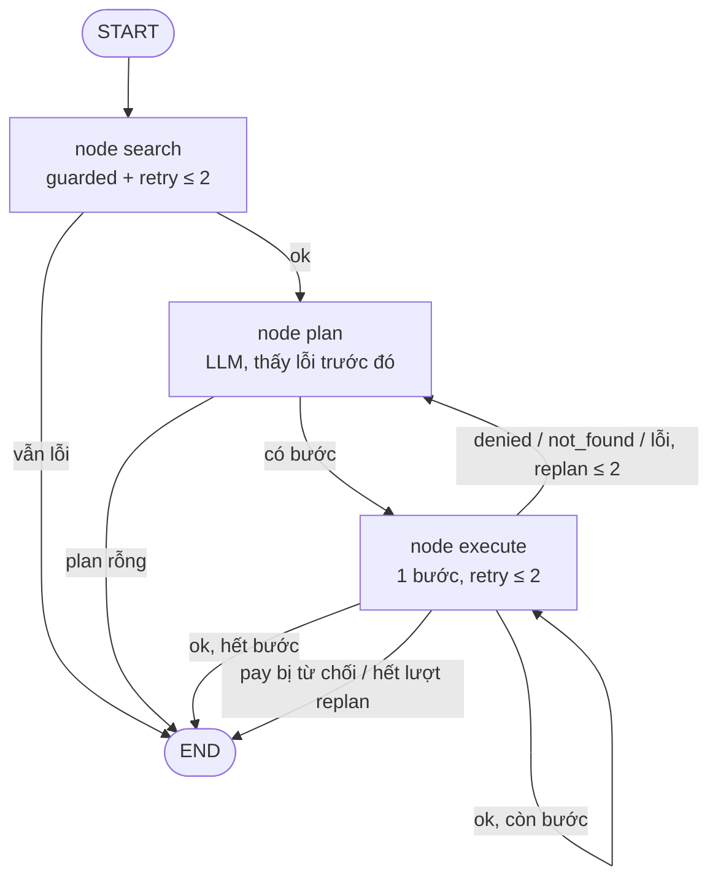

# BTVN#3 - Dựng agent đặt vé máy bay bằng LangChain: Harness và so sánh 3 design pattern

## 1. Tổng quan

### 1.1 Đề bài

> Tìm hiểu LangChain, LangGraph → Tạo tool mockup → Viết lớp harness cho Agent này. Nộp `.py` kèm báo cáo.
>
> 1. Cài đặt đủ các lớp harness: ràng buộc là dữ liệu, tiêu chí hoàn thành kiểm bằng code, kiểm quyền, bàn giao;
> 2. Cài đặt Agent với 3 mẫu thiết kế: ReAct, Plan-then-Execute, Lai;
> 3. Đánh giá hiệu quả của Agent với 3 mẫu thiết kế khác nhau.

Link GitHub: https://github.com/hohoangluan/btvn3-flight-booking-agent

| Yêu cầu | Đáp ứng trong bài | Mục |
|---|---|---|
| Tool mockup | 4 tool trên 10 chuyến bay giả | 4 |
| 1. Harness | `Constraints`, `is_done()`, `PERMISSION` + `check()`, `handoff()` | 5 |
| 2. Ba mẫu thiết kế | `react()`, `plan_execute()`, `hybrid()` | 6 |
| 3. Đánh giá | `evaluate.py`: 15 case × 3 pattern × 3 lần | 7, 8 |

### 1.2 Bài toán

Agent nhận yêu cầu đặt vé máy bay bằng ngôn ngữ tự nhiên, ví dụ: *"Đặt 1 vé SGN → DAD ngày 2026-10-07, khởi hành trước 12:00, giá tối đa 2.000.000 VND."* Agent phải tìm chuyến, đặt chỗ, thanh toán và xác nhận kết quả. Hai điểm khó:

- Ràng buộc cứng (tuyến, ngày, giờ khởi hành, giá). Chuyến rẻ nhất có thể bay chiều; chuyến đúng giờ có thể quá đắt.
- Thanh toán tốn tiền và không hoàn tác được, nên cần người duyệt.

### 1.3 Mục tiêu

1. Xây agent đặt vé với một **harness** (lớp kiểm soát bằng code, model không bỏ qua được): ràng buộc là dữ liệu, hoàn thành được kiểm tra bằng code, có phân quyền, có handoff cho người.
2. Cài cùng agent theo **3 pattern**: ReAct, Plan-then-Execute, Hybrid.
3. **Đánh giá** 3 pattern trên cùng một benchmark, đo tỉ lệ đạt kỳ vọng, số tool call, token và độ trễ.

## 2. Cấu hình môi trường

**Hệ thống.** Windows 11, Python 3.13.

**Thư viện** (`requirements.txt`, pin đúng version đã chạy benchmark):

| Package | Version | Dùng cho |
|---|---|---|
| `langchain` | 1.4.3 | `create_agent`, middleware (`wrap_tool_call`, `ModelCallLimitMiddleware`) |
| `langchain-core` | 1.6.6 | prompt, structured output, callback đếm token |
| `langchain-openai` | 1.6.7 | `ChatOpenAI` |
| `langgraph` | 1.2.12 | `StateGraph` cho Plan-then-Execute, Hybrid, Hybrid + Replan; runtime graph mà `create_agent` biên dịch thành |
| `pydantic` | 2.13.4 | schema `Plan` / `Step` |
| `python-dotenv` | 1.2.2 | đọc `.env` |
| `pandas` | 3.0.3 | tổng hợp kết quả benchmark |
| `pytest` | 9.0.3 | unit test harness |

**Biến môi trường** (file `.env`, đã git-ignore):

| Biến | Ý nghĩa |
|---|---|
| `NINEROUTER_API_KEY` | API key (bắt buộc) |
| `NINEROUTER_URL` | endpoint OpenAI-compatible, mặc định `http://localhost:20128/v1` |
| `NINEROUTER_MODEL` | tên model; benchmark dùng `ag/gemini-3.8-flash-low` |

File mẫu `.env.example` (có sẵn trong repo) liệt kê đủ 3 biến với giá trị placeholder; copy thành `.env` và điền API key.

LLM được gọi qua **9router**, một router cục bộ có endpoint OpenAI-compatible, nên code chỉ cần `ChatOpenAI(base_url=..., api_key=..., model=...)`. Muốn đổi sang nhà cung cấp OpenAI-compatible khác chỉ cần sửa `.env`.

**Cách chạy.**

```bash
pip install -r requirements.txt
pytest -q test_harness.py                          # 13 test, không cần LLM
python flight_agent.py react                       # chạy 1 pattern, hỏi duyệt thanh toán
python evaluate.py --repeats 3                     # benchmark 3 pattern bắt buộc
python evaluate.py --patterns hybrid_replan --repeats 3   # bonus (Phụ lục A)
```

## 3. LangChain và LangGraph

Cả ba pattern đều chạy trên LangChain + LangGraph:

| | LangChain | LangGraph |
|---|---|---|
| Chung | `ChatOpenAI` trỏ tới 9router, `UsageMetadataCallbackHandler` đếm token | |
| ReAct | `create_agent`, middleware `@wrap_tool_call` (harness), `ModelCallLimitMiddleware(10)` | graph do `create_agent` biên dịch (`model` ⇄ `tools`) |
| Plan-then-Execute | `ChatPromptTemplate` + `with_structured_output(Plan)` (planner) | `StateGraph`: `search → plan → execute` |
| Hybrid | `create_agent` cho bước find | `StateGraph`: `find → select → book → pay → verify` |
| Hybrid + Replan (bonus) | planner như Plan-then-Execute | `StateGraph`: `search → plan → execute`, có cạnh `execute → plan` |

**ReAct.** `create_agent` của LangChain 1.x được biên dịch thành một `CompiledStateGraph` của LangGraph. Graph của agent ReAct:



**Plan-then-Execute, Hybrid, Hybrid + Replan.** Mỗi pattern là một `StateGraph` dựng bằng helper `build(nodes, edges)`. Các pattern dùng chung một `State` (`TypedDict`: `flights`, `steps`, `plans`, `failed`, `tries`, `flight`, `code`, `done`). Mỗi bước là một **node**; node nào gọi tool đều gọi qua `guarded()`. **Cạnh** điều kiện (`add_conditional_edges`) là hàm Python đọc `State`/`LOG`: code quyết định bước kế tiếp, LLM không chọn cạnh. Đây là điểm khác cốt lõi so với graph ReAct, nơi cạnh `model → tools` phụ thuộc việc LLM có gọi tool hay không. Vòng lặp (execute từng bước, find thử lại, replan) là cạnh quay lại node, không phải vòng `for`. Node nào gọi LLM (`plan`, `find`) nhận `config` của graph và truyền tiếp cho planner/sub-agent, nên callback đếm token vẫn bắt đủ mọi lần gọi.

Sub-agent ReAct của Hybrid (`create_agent`) được gọi bên trong node `find`, nên Hybrid là graph lồng graph: graph ngoài do code điều khiển, graph trong do LLM điều khiển.

## 4. Mock Flight Environment

### 4.1 Dữ liệu

10 chuyến giả trong `FLIGHTS`:

| Tuyến | Chuyến | Giờ | Giá (VND) | Ghi chú |
|---|---|---|---|---|
| SGN→DAD 2026-10-07 | VN122 | 08:10 | 1.850.000 | hợp lệ |
| | VJ604 | 08:30 | 2.480.000 | quá đắt |
| | VJ606 | 10:30 | 1.350.000 | hợp lệ, rẻ nhất |
| | QH118 | 15:40 | 1.640.000 | chiều |
| SGN→HAN 2026-10-07 | VN210 | 06:30 | 2.300.000 | |
| | VJ150 | 09:45 | 1.450.000 | |
| | VN212 | 11:20 | 1.900.000 | |
| | QH220 | 13:00 | 1.100.000 | |
| HAN→SGN 2026-10-08 | VN301 | 07:00 | 1.700.000 | |
| | VJ302 | 18:30 | 1.200.000 | |

### 4.2 Tools

| Tool | Chức năng | Quyền |
|---|---|---|
| `search_flights(origin, destination, date)` | Tìm chuyến; `FAIL_SEARCH` giả lập timeout | allow |
| `book_seat(flight)` | Giữ chỗ, mã `<flight>-12A`, chưa thu tiền | allow, phải thỏa ràng buộc |
| `pay(code)` | Thanh toán, không hoàn tác | ask (cần người duyệt) |
| `get_booking(code)` | Đọc lại booking | allow |

Tool không có trong bảng quyền bị deny.

## 5. Implementation: Harness

| Yêu cầu đề | Implementation (`flight_agent.py`) | Nơi kiểm chứng |
|---|---|---|
| Constraint as data | `Constraints`, `to_prompt()`, `is_ok()` | `test_constraints_are_data`; case A–C |
| Completion by code | `is_done()` đọc lại booking | `test_done_is_checked_by_code`, `test_two_paid_bookings_is_not_done`; cột `got` |
| Permission | `PERMISSION`, `check()`, `APPROVE` | `test_booking_that_breaks_constraints_is_denied`, `test_payment_needs_human_approval`; case D1; cột `denied` |
| Handoff | `handoff()` | `test_handoff_reason_matches_failure`; case C, D, E2 |
| ReAct | `react()`: `create_agent` | benchmark (mục 8) |
| Plan-then-Execute | `plan_execute()`: `StateGraph` | benchmark |
| Hybrid | `hybrid()`: `StateGraph` + `create_agent` trong node find | benchmark |

Unit test: `pytest -q test_harness.py` (13 test, không cần LLM).

**Constraints là dữ liệu.** `Constraints(origin, destination, date, depart_before, max_price, note)`. `to_prompt()` sinh yêu cầu gửi model, `is_ok(flight)` kiểm tra bằng code. Prompt và kiểm tra cùng lấy từ một nguồn. Cần phân biệt hai loại thông tin:

- **Ràng buộc cứng có cấu trúc** (`origin`, `destination`, `date`, `depart_before`, `max_price`): harness bắt buộc kiểm qua `is_ok`.
- **Ý định ngữ nghĩa của người dùng** (`note`): văn bản tự do, **không phải** ràng buộc cứng. Được đưa vào prompt để LLM đọc, nhưng harness không có schema để kiểm. `note` có thể chứa một mong muốn tường minh mâu thuẫn với ràng buộc cứng (case F1: *explicit preference conflict*).

**Hoàn thành bằng code.** `is_done()` đọc lại mọi booking. Done khi đúng một booking đã thanh toán và thỏa `is_ok`. Lời model không được tin. Unit test phủ: chưa book → false; book nhưng chưa pay → false; pay → true; hai booking đã trả tiền → false.

**Phân quyền.** `PERMISSION = {search_flights: allow, get_booking: allow, book_seat: allow, pay: ask}`; tool không liệt kê bị deny. `check()` chặn trước khi chạy: tool deny, call giống hệt đã chạy 3 lần (loop guard chặn lần thứ 4), `book_seat` vi phạm ràng buộc, `pay` chưa được duyệt. Call bị chặn trả về `status = denied` như dữ liệu, để model/planner thấy lý do. Kết quả `{}` là lỗi, không phải "không tìm thấy". Mọi tool action do agent thực hiện (ở cả 3 pattern) đều phải đi qua `guarded()`; với `create_agent`, `guarded()` được gắn làm middleware `harness`. Riêng completion verifier `is_done()` đọc lại booking trực tiếp bằng code (`get_booking`) để xác minh trạng thái cuối; đây là kiểm tra nội bộ của harness, không phải action của agent.

**Handoff.** `handoff()` trả `reason` (ưu tiên `payment` → `tool_error` → `constraints`), `done_so_far`, `tried`, `question` để người tiếp quản biết đã làm gì và cần quyết định gì.

## 6. Ba pattern bắt buộc

Cùng model, tool, harness và `is_done()`. Khác nhau ở chỗ ai quyết định bước kế tiếp.

| | ReAct | Plan-then-Execute | Hybrid |
|---|---|---|---|
| Cài đặt | `create_agent` (LangChain → LangGraph) | `StateGraph` 3 node | `StateGraph` 5 node, node find chứa `create_agent` |
| Ai chọn bước kế tiếp | LLM, mỗi bước | LLM viết plan một lần; cạnh graph (code) chạy plan | Cạnh graph (code, flow cố định); LLM chỉ trong find |
| Số lần gọi LLM | biến thiên, tối đa 10 (`ModelCallLimit`) | đúng 1 | biến thiên, chỉ trong find: tối đa 2 lần chạy node find, mỗi lần tối đa 10 |
| Phục hồi khi tool lỗi | có (LLM tự retry) | không | có, chỉ ở bước find |

**ReAct**: `create_agent` + middleware `harness` + `ModelCallLimitMiddleware(10)`. Model quyết định từng bước dựa trên quan sát của bước trước; mỗi lần gọi gửi lại toàn bộ lịch sử. Graph ở mục 3.

**Plan-then-Execute**: `StateGraph` 3 node. `search` gọi tool (lỗi thì cạnh đi thẳng tới `END`, không gọi LLM); `plan` gọi `PLANNER | with_structured_output(Plan)` đúng một lần để viết cả plan; `execute` chạy **một** bước rồi cạnh quay lại chính nó cho tới khi hết bước, thay `$booking_code` bằng mã thật. Bước nào lỗi thì `execute` xóa phần plan còn lại, cạnh đi tới `END`. Graph không có cạnh quay về `plan`: pattern cố ý không có vòng phản hồi, làm đối chứng với ReAct.



**Hybrid**: kết hợp *suy luận agentic* cho bước cần thích ứng với *thực thi tất định bằng code* cho các bước nhạy cảm. `StateGraph` 5 node. Find là bước không chắc chắn (tool có thể lỗi), nên node `find` gọi một agent ReAct nhỏ (`create_agent`) chỉ có `search_flights` (read-only); agent tự retry trong một lần chạy, và cạnh `find → find` cho thêm tối đa 1 lần chạy lại nếu vẫn chưa có kết quả. Các bước có hậu quả là node code: `select` lọc `is_ok` và lấy chuyến rẻ nhất; `book`; `pay` (cần duyệt); `verify` gọi `is_done()`.



## 7. Thiết lập thực nghiệm

**Case** (`evaluate.py`, 15 case, 6 nhóm):

| Nhóm | Case | Kỳ vọng |
|---|---|---|
| A. Đơn giản | A1–A3 | DONE |
| B. Nhiều ràng buộc | B1–B3 | DONE |
| C. Bất khả thi | C1–C4 | FAILED:constraints |
| D. Từ chối thanh toán | D1 | FAILED:payment |
| E. Lỗi tool | E1 (lỗi 1 lần), E2 (lỗi mãi) | DONE / FAILED:tool_error |
| F. Ý định ngữ nghĩa xung đột | F1 (*explicit preference conflict*: đòi đúng QH118), F2 (mong muốn mơ hồ: rẻ nhất, mọi giờ) | F1: FAILED:constraints; F2: DONE |

**Chỉ số.**

- **pass%** (case pass rate, cột `success%` trong output `evaluate.py`): tỉ lệ run có kết quả đúng kỳ vọng `DONE` / `FAILED:<reason>`. Đây không phải tỉ lệ đặt vé thành công: một case C kết thúc `FAILED:constraints` đúng lý do vẫn tính là pass.
- **handoff%**: pass% chỉ trên các case phải FAILED (C, D1, E2, F1).
- **tool_calls**, **denied** (call bị harness chặn), **tokens**, **latency**: trung bình mỗi run.

**Cấu hình.** `ag/gemini-3.8-flash-low` qua 9router, `temperature=0`. Chạy `python evaluate.py --repeats 3` (mặc định 3 pattern bắt buộc). Run tuần tự vì trạng thái là biến module.

**Lưu ý token.** Router cộng ~2000 token mỗi lần gọi LLM. Token dùng để so sánh giữa các pattern trên cùng hạ tầng, không phải số tuyệt đối của thuật toán. Latency dao động 5–75 s, nên ưu tiên tool_calls và kết quả.

## 8. Kết quả

### 8.1 Benchmark chính (15 case × 3 lần)

| Pattern | pass% | handoff% | tool_calls | denied | tokens | latency (s) |
|---|---|---|---|---|---|---|
| ReAct | **100.0** | 100.0 | 2.5 | 0.2 | 9287 | 11.9 |
| Plan-then-Execute | 93.3 | 100.0 | 2.5 | 0.1 | 2457 | 6.2 |
| Hybrid | 93.3 | 85.7 | 2.7 | 0.3 | 5785 | 8.8 |

Số liệu từ lần chạy sau khi chuyển Plan-then-Execute và Hybrid sang `StateGraph` (cả 4 pattern chạy cùng một đợt). So với bản Python thuần trước đó, pass%, handoff%, tool_calls, denied và các case hỏng giữ nguyên; token lệch dưới 3%. Latency thấp hơn đợt cũ ở mọi pattern do tải router, không phải do LangGraph.

pass% theo nhóm:

| Nhóm | ReAct | Plan-then-Execute | Hybrid |
|---|---|---|---|
| A–D | 100 | 100 | 100 |
| E. Lỗi tool | 100 | **50** | 100 |
| F. Ý định ngữ nghĩa xung đột | 100 | 100 | **50** |

- **Plan-then-Execute hỏng E1 (3/3)**: search lỗi một lần là dừng, không gọi model. Đây đúng là failure mode mà pattern không có vòng quan sát phải bộc lộ.
- **Hybrid hỏng F1 (3/3)**: người dùng muốn QH118, hệ thống đặt VJ606 và báo DONE mà không hỏi. Select là code, không đọc `note`.
- Denied trong benchmark đến từ D1 (pay bị từ chối) và loop guard ở E2. Không có `book_seat` vi phạm nào bị chặn, nên khả năng chặn đặt sai chỉ được chứng minh bằng unit test.

### 8.2 Đọc kết quả

ReAct đạt pass% cao nhất nhưng dùng nhiều token nhất. Plan-then-Execute dùng ít token hơn ReAct khoảng 3.8× (2.5k so với 9.3k), nhưng không phục hồi được lỗi tool. Hybrid dùng ít token hơn ReAct khoảng 1.6× và kiểm soát được flow, nhưng không nhận biết ý định tường minh của người dùng nằm trong `note`. Token ở đây chưa quy ra chi phí tiền. Với 3 lần lặp, 93.3% so với 100% là đúng 3 run hỏng: tín hiệu định hướng, không phải kết luận thống kê.

## 9. Thảo luận

**F1: semantic user intent / explicit preference conflict.** F1 (*"I love flight QH118, please book exactly that one."*) **không** biến `note` thành ràng buộc cứng. `note` vẫn là văn bản tự do; ràng buộc cứng chỉ gồm các trường có cấu trúc, và VJ606 thỏa tất cả, nên `is_ok` và `is_done()` đều cho qua. Cái F1 kiểm tra là cách agent xử lý **ý định tường minh** của người dùng khi ý định đó xung đột với ràng buộc cứng. Người dùng không xin "một chuyến hợp lệ bất kỳ" mà chỉ đích danh QH118, và QH118 vi phạm `depart_before=12:00`. Hai yêu cầu này không thể cùng thỏa. Hành vi đúng là hỏi lại người dùng muốn nới ràng buộc nào (handoff), không phải lặng lẽ đặt một chuyến khác mà họ không yêu cầu. Vì vậy kỳ vọng là `FAILED:constraints`: nhãn `constraints` chỉ lý do handoff ("không có chuyến nào thỏa cả ràng buộc lẫn yêu cầu"), không có nghĩa `note` là ràng buộc. Đối chiếu với F2 (*"cheapest flight of the day, whatever the time"*): mong muốn mơ hồ, không chỉ đích danh chuyến nào, nên đặt chuyến hợp lệ rẻ nhất là đúng (`DONE`).

Hybrid hỏng F1 vì select là code, không đọc `note`, nên thay QH118 bằng VJ606 mà không hỏi. ReAct và Plan-then-Execute qua được F1 vì LLM có đọc `note`. Hướng sửa là nâng loại ý định này thành trường có cấu trúc (ví dụ `flight` bắt buộc) để harness kiểm được bằng code; báo cáo này chưa thử hướng đó.

**Giới hạn.** 3 lần lặp, một model, dữ liệu mock 10 chuyến. Model hầu như không thử đặt chuyến vi phạm, nên khả năng chặn của harness chủ yếu được kiểm bằng unit test.

## 10. Kết luận

Trong ba pattern bắt buộc, ReAct đạt pass% cao nhất (100%) nhưng tốn token nhất (≈9.3k/run). Plan-then-Execute ít token nhất (≈2.5k) nhưng không phục hồi được lỗi tool (E1 hỏng 3/3). Hybrid kiểm soát flow và ít token hơn ReAct (≈5.8k), nhưng hỏng F1 (3/3): ý định tường minh của người dùng nằm trong `note` tự do, ngoài schema mà harness kiểm được, và bước select bằng code không đọc nó.

Từ hạn chế của Hybrid, nhóm thử thêm cải tiến Hybrid + Replan ở Phụ lục A, đạt 100% trên benchmark. Kết luận chính vẫn là so sánh ba pattern bắt buộc; benchmark quy mô nhỏ nên chưa đủ để xếp hạng chắc chắn.

---

## Phụ lục A: Thí nghiệm mở rộng (Bonus)

Chạy: `python evaluate.py --patterns hybrid_replan --repeats 3`.

**A.1 Hybrid + Replan.** `StateGraph` cùng 3 node như Plan-then-Execute (`search → plan → execute`), thêm cạnh `execute → plan`. LLM lập plan một lần; node `execute` chạy và quan sát từng bước. Lỗi tạm thời được sửa tại chỗ bằng retry bên trong node (tối đa 2 lần, không gọi LLM). Bước bị `denied`/`not_found` hoặc lỗi còn lại sau retry thì cạnh quay về `plan` để replan (tối đa 2 lần), planner thấy lý do lỗi trong `So far`. Không search lại khi replan. Đúng đắn ở F1 vẫn dựa vào planner LLM đọc `note`. Kiểm chứng đường đi bằng `test_replan_*` với planner giả: retry lỗi tool mà không replan; lỗi kéo dài → handoff; planner thấy lý do bị deny; không search lại; người từ chối thanh toán → không replan.



**A.2 Kết quả (15 case × 3 lần)**

| Pattern | pass% | handoff% | tool_calls | denied | tokens | latency (s) |
|---|---|---|---|---|---|---|
| Hybrid + Replan | 100.0 | 100.0 | 2.9 | 0.1 | 2473 | 4.5 |

Đạt 100% ở mọi nhóm, gồm F1.
